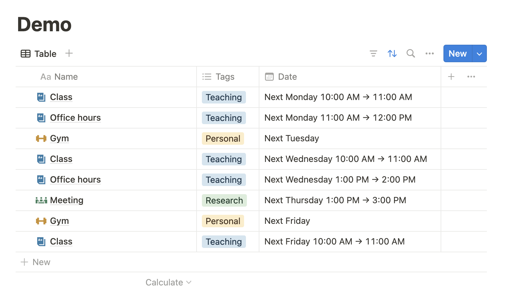

# Notion Page Automator

## Overview

Notion Page Automator is a Python program that automates the creation of pages in Notion databases.
I personally use Notion as my calendar/to-do-list app, and I use the program to automatically create recurring tasks, such as weekly meetings or classes.

## Demo

The following is an example of creating the following routine tasks over first two weeks of April 2024.

1. Meeting: every Thursday 9 - 10:30am
2. Class: every Monday & Wednesday 1 - 2pm & every Friday 3 - 4pm
3. Gym: every Saturday



The following code from demo_config.py demonstrates the process of creating the Notion pages:

1. First, the `routines_to_pages` function generates `NotionPage` objects for all routine tasks defined in `get_routines` within the specified time frame.
2. Next, the `create_pages_batch` function posts all the generated pages to Notion using their API.

```python
# demo_config.py
import dotenv
import os

from notion_api import NotionAPI
from notion_create_page import create_pages_batch
from notion_page import NotionPage
from routines import Routine, routines_to_pages, TimeFrame

async def create_routine_pages_demo() -> None:

    # Get the routines defined in the function get_routines()
    routines: list[Routine] = get_routines()

    # Define the time frame for creating routine pages
    # Starting from Monday, April 1, 2024, and spanning 2 weeks
    time_frame = TimeFrame(first_date=datetime.date(year=2024, month=4, day=1), length=datetime.timedelta(weeks=2))

    # Generate Notion pages based on the routines and the specified time frame
    pages: list[NotionPage] = routines_to_pages(routines, time_frame)

    # Import Notion integration key from .env file, create a NotionAPI object, and use it to create all the Notion pages
    dotenv.load_dotenv()
    notion_api = NotionAPI(os.getenv("NOTION_INTEGRATION_KEY"))
    await create_pages_batch(notion_api, pages)
```

```python
# main.py
import asyncio

from demo_config import create_routine_pages_demo

async def main() -> None:
    await create_routine_pages_demo()
    return

if __name__ == "__main__":
    asyncio.run(main())
```

## Usage

### Pre-requisite

- Python: >= 3.11
- [python-dotenv](https://pypi.org/project/python-dotenv/): 1.0.1
- [requests](https://pypi.org/project/requests/): 2.31.0

### Environment variable

Create a `.env` file in the directory that includes the following.

- `NOTION_INTEGRATION_KEY`: follow the [official guide](https://developers.notion.com/docs/create-a-notion-integration#create-your-integration-in-notion) to create your integration in Notion [here](https://www.notion.so/profile/integrations)
- `NOTION_DATABASE_ID`: the database ID can be found in the URL as explained [here](https://developers.notion.com/reference/retrieve-a-database), and the database has to be [connected to your integration](https://developers.notion.com/docs/create-a-notion-integration#give-your-integration-page-permissions)

```Shell
#.env
NOTION_INTEGRATION_KEY = "secret_XXXXXXXXXXXXXXXXXXXXXXXXXXXXXXXXXXXXXXXXXXX"
NOTION_DATABASE_ID = "XXXXXXXX-XXXX-XXXX-XXXX-XXXXXXXXXXXX"
```

### Key Classes and Functions

#### Creating pages through Notion API

notion_create_page.**create_pages_batch**(notion_api, pages)

- Asynchronously posts multiple Notion pages to the Notion API.
- Inputs:
  - notion_api (NotionAPI): An instance of the NotionAPI class for authenticated communication with the Notion API.
  - pages (list[NotionPage]): A list of NotionPage objects to be created in Notion.

_class_ notion_api.**NotionAPI**(integration_key)

- Manages integration with the Notion API.
- Inputs:
  - integration_key (str): The API integration key for authenticated communication with the Notion API.

#### Notion pages and properties

_class_ notion_page.**NotionPage**(database_id, title, props, icon = None)

- Description: Represents a page to be created in Notion.
- Inputs:
  - database_id (str): The ID of the parent database in Notion.
  - title (NotionPropPlainTitle): The title of the Notion page.
  - props (list[NotionProp]): A list of properties for the Notion page.
  - icon (NotionIcon, optional): An optional icon for the Notion page.

_class_ notion_property.**NotionPropDate**(name)

- Description: Represents a date property for a Notion page.
- Inputs:
  - name (str): The name of the property.
  - start_datetime (datetime.date or datetime.datetime): The start date or datetime.
  - duration (datetime.timedelta, optional): An optional duration for the date property.

_class_ notion_property.**NotionPropMultiSelect**(name)

- Description: Represents a multi-select property for a Notion page.
- Inputs:
  - name (str): The name of the property.
  - options (list[str]): A list of selectable options.

_class_ notion_property.**NotionPropPlainTitle**(name)

- Description: Represents the title property of a Notion page.
- Inputs:
  - name (str): The name of the property.
  - title (str): The title content.

#### Routines

routines.**routines_to_pages**(routines, time_frame: TimeFrame) -> list[NotionPage]

- Description: Converts a list of routines and a time frame into a list of Notion pages.
- Inputs:
  - routines (list[Routine]): A list of Routine objects.
  - time_frame (TimeFrame): An instance of the TimeFrame class defining the time frame for the routines.

_class_ routines.**Routine**

- Description: Encapsulates the details of a routine task.
- Inputs:
  - prototype_page (NotionPage): A prototype NotionPage object to base the routine on.
  - repeat (set[int]): A set of integers (0-6, with 0 = Monday, 1 = Tuesday, etc.) representing the days of the week the routine repeats.
  - date_prop_name (str): The name of the date property.
  - start_time (datetime.time, optional): The start time of the routine.
  - duration (datetime.timedelta, optional): The duration of the routine.
- The following constants can be used in the repeat attribute of the Routine class to specify the days on which the routine should occur.
  - routines.EVERY_MON = {0}
  - routines.EVERY_TUE = {1}
  - routines.EVERY_WED = {2}
  - routines.EVERY_THU = {3}
  - routines.EVERY_FRI = {4}
  - routines.EVERY_SAT = {5}
  - routines.EVERY_SUN = {6}
  - routines.EVERY_DAY = {0,1,2,3,4,5,6}

_class_ routines.**TimeFrame**

- Description: Defines a time frame for creating routine pages.
- Inputs:
  - first_date (datetime.date): The start date of the time frame.
  - length (datetime.timedelta): The duration of the time frame.
