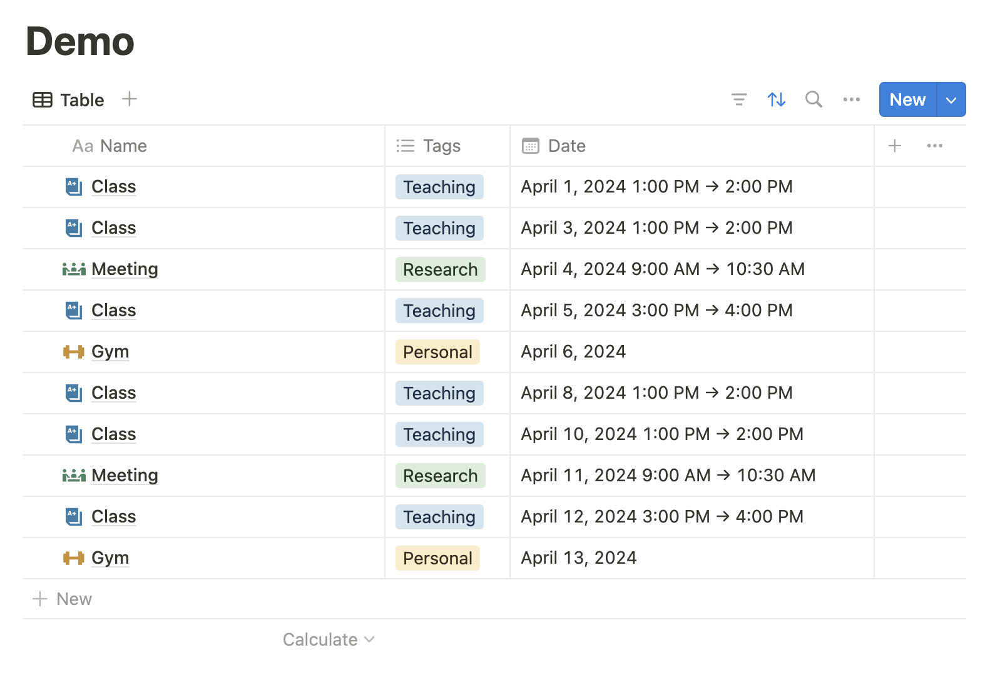

# Notion Page Automator

## Overview

Notion Page Automator is a Python program that automates the creation of pages in Notion databases.
I personally use Notion as my calendar/to-do-list app, and I use the program to automatically create recurring tasks, such as weekly meetings or classes.

## Demo

The following is an example of creating routine tasks over the week starting from Monday, July 8, 2024.

```Python
# main.py
import asyncio
import datetime

from demo_config import create_routine_pages_demo
from routines import TimeFrame

async def main() -> None:
    time_frame = TimeFrame(first_date=datetime.date(year=2024, month=7, day=8), length=datetime.timedelta(weeks=1))
    await create_routine_pages(time_frame)
    return

if __name__ == "__main__":
    asyncio.run(main())
```

```Python
# demo_config.py
import dotenv
import os

from notion_api import NotionAPI
from notion_create_page import create_pages_batch
from notion_page import NotionPage
from routines import Routine, routines_to_pages

async def create_routine_pages(time_frame: TimeFrame) -> None:

    dotenv.load_dotenv()
    notion_api = NotionAPI(os.getenv("NOTION_INTEGRATION_KEY"))

    routines: list[Routine] = get_routines()
    pages: list[NotionPage] = routines_to_pages(routines, time_frame)

    await create_pages_batch(notion_api, pages)

    return
```

The `routines` returned by `get_routines()` contained the following. (More details below)

1. Meeting: every Thursday 1-3pm
2. Class: every Monday & Wednesday 10-11am
3. Office hours: every Monday 11am-noon & Wednesday 1-2pm
4. Gym: every Tuesday & Friday

The following is the result on Notion.



## Usage

### Pre-requisite

- Python: >= 3.8
- [python-dotenv](https://pypi.org/project/python-dotenv/): 1.0.1
- [requests](https://pypi.org/project/requests/): 2.31.0

### Environment variable

Create a `.env` file in the directory that includes the following.

- `NOTION_INTEGRATION_KEY`: follow the [official guide](https://developers.notion.com/docs/create-a-notion-integration#create-your-integration-in-notion) to create your integration in Notion [here](https://www.notion.so/profile/integrations)
- `NOTION_DATABASE_ID`: the database ID can be found in the URL as explained [here](https://developers.notion.com/reference/retrieve-a-database), and the database has to be [connected to your integration](https://developers.notion.com/docs/create-a-notion-integration#give-your-integration-page-permissions)

```Shell
#.env
NOTION_INTEGRATION_KEY = "secret_XXXXXXXXXXXXXXXXXXXXXXXXXXXXXXXXXXXXXXXXXXX"
NOTION_DATABASE_ID = "XXXXXXXX-XXXX-XXXX-XXXX-XXXXXXXXXXXX"
```
